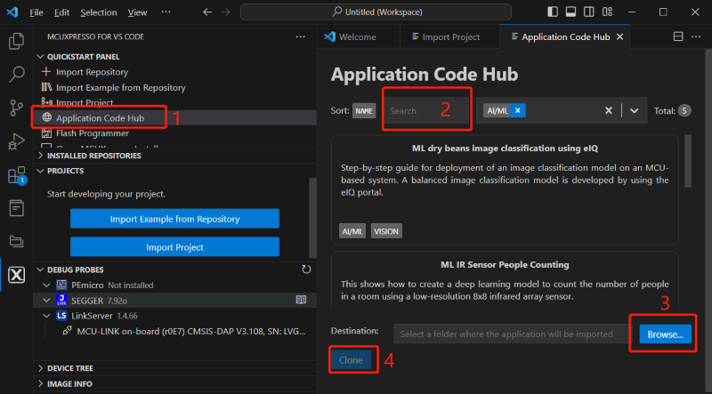

# NXP Application Code Hub

## Time Series Studio powered, on-device learning Fan anomaly detection based on FRDM-MCXA156

An application designed for monitoring the status of the fan, which utilizes an accelerometer sensor attached to the fan to check if the fan is operating in a normal condition.
Application is based on FRDM-MCXA156 with 96MHze Cortext-M33, 1M Flash and 128KB SRAM inside 

The Appliccation is powered by IKM(Incremental KMeans for anomaly detection) model, which is trained and generated by eIQ Time Series Studio and support on-device learning as well.
Model size is 7 KB and RAM requirement is 4 KB
Model inference during is 6ms 

How to train the model, please refer to AN14549 from nxp.com.

Below charts are the block of system and software workflow.

#### Boards: FRDM-MCXA156
#### Categories: AI/ML, Anomaly Detection
#### Peripherals: DISPLAY, I2C
#### Toolchains: MCUXpresso IDE

## Table of Contents
1. [Software](#step1)
2. [Hardware](#step2)
3. [Setup](#step3)
4. [Results](#step4)
5. [FAQs](#step5) 
6. [Support](#step6)
7. [Release Notes](#step7)

## 1. Software

- Download [SDK_2_16_0_FRDM-MCXA156](https://mcuxpresso.nxp.com/en/welcome)
- Download and install [MCUXpresso IDE V11.9.0 or later](https://www.nxp.com/design/design-center/software/development-software/mcuxpresso-software-and-tools-/mcuxpresso-integrated-development-environment-ide:MCUXpresso-IDE).
- MCUXpresso for Visual Studio Code: This example supports MCUXpresso for Visual Studio Code, for more information about how to use Visual Studio Code please refer [here](https://www.nxp.com/design/training/getting-started-with-mcuxpresso-for-visual-studio-code:TIP-GETTING-STARTED-WITH-MCUXPRESSO-FOR-VS-CODE).
- Download and install [eIQ Toolkit 1.13.1](https://www.nxp.com/design/design-center/software/eiq-ml-development-environment/eiq-toolkit-for-end-to-end-model-development-and-deployment:EIQ-TOOLKIT#downloads)

## 2. Hardware

- [FRDM-MCXA156](https://www.nxp.com/part/FRDM-MCXA156)
- [PAR-LCD-S035](https://www.nxp.com/design/design-center/development-boards-and-designs/general-purpose-mcus/3-5-480x320-ips-tft-lcd-module:LCD-PAR-S035)
- [ACCEL-4-CLICK](https://www.mikroe.com/accel-4-click)
- FAN
- Type-C USB cable

## 3. Setup

### 3.1 Step 1

- Connect board with LCD
 
  

- Mounting ACCEL-4-CLICK to the FAN
 
  

- Connect board with ACCEL-4-CLICK
 
  

- Connect debug port
 
  

- whole system
 
  

### 3.2 Step 2

Import "dm-tss-powered-on-device-learning-fan-anomaly-based-on-mcxa156" from Application Code Hub

- Import project in MCUXpresso IDE
 
  

- Import project in VS code
 
  

- Build project and download to the board  

- **Notice: please erase the whole flash before download the firmware**

## 4. Results
- Turn on the Fan, then normal state is detected,Switch the speed of Fan, the state of Fan remain normal
 
  

- Knock on the Fan than anomaly is detected
 
  

- Disrupting the operation of the Fan blades, anomaly is detected
 
  

- Modify the mounting angle of ACCEL-4-CLICK by rotating it 90 degrees in the counterclockwise direction. An anomaly has been detected.
 
  

 ### Training on Device
 - Enter Trainer window, click start button ensure that don’t move the Fan during the training procedure
  
   

 - Return to main after training is complete
 
   

 - If the model fails to accurately recognize other speeds, then conduct the training once more.
 

## 5. FAQs

## 6. Support

#### Project Metadata

<!----- Boards ----->

<!----- Categories ----->

<!----- Peripherals ----->

<!----- Toolchains ----->

Questions regarding the content/correctness of this example can be entered as Issues within this GitHub repository.

>**Warning**: For more general technical questions regarding NXP Microcontrollers and the difference in expected functionality, enter your questions on the [NXP Community Forum](https://community.nxp.com/)

## 7. Release Notes
| Version | Description / Update                           | Date                        |
|:-------:|------------------------------------------------|----------------------------:|
| 1.0     | Initial release on Application Code Hub        | November 27th 2024 |

## Licensing

LA_OPT_NXP_Software_License v58

## Origin

*if applicable - note components your application uses regarding to license terms - with authors / licenses / links to licenses, otherwise remove this section*